# A Comprehensive Introduction to the Zephyr Project

## Agenda
1. Introduction
   1. What is Zephyr?
   2. History.
2. Building an embedded application.
   1. The software development life-cycle.
   2. The architecture.
   3. The traditional approach.
      1. The hardware layer.
      2. The system software layer.
      3. The application layer.
3. The Zephyr approach.
4. Why it matters?
   1. Business constraints.
      1. Time to market.
      2. Vendor Lock-in.
      3. Cost.
      4. Learning curve.
   2. Engineering constraints.
      1. Real-time determinism.
      2. Memory footprint.
      3. Power consumption.
      4. Portability.
      5. Modularity.
   3. Compliance constraints.
      1. Safety certifications.
      2. Long term support (LTS).
5. Where Zephyr fits.
   1. Scale.
   2. Target Market.
   3. The OS spectrum.
6. Security.
   1. The security model.
   2. Memory protection model.
   3. Secure boot.
   4. The CVE process.
7. The OS Design.
   1. An RTOS vs a GP OS.
   2. Zephyr vs FreeRTOS vs Linux.
      1. Overall Design.
      2. The Scheduler.
      3. Device Driver model.
      4. Other subsystems.
      5. Configuration and Build system.
   3. Size and performance
      1. RAM/ROM footprint.
      2. Interrupt latency, IPC, and synchronization
      3. The C library.
8. Where is Zephyr going?
   1. The community.
   2. The Future of Zephyr.
9. Resources

# 1.0 Introduction

## 1.1 What is Zephyr?

- The Zephyr™ Project, is a Linux Foundation hosted Collaboration Project, an open source collaborative effort uniting leaders from across the industry to build a best-in-breed small, scalable, real-time operating system (RTOS) optimized for resource constrained devices, across multiple architectures. The Zephyr Project’s goal is to establish a neutral project where silicon vendors, OEMs, ODMs, ISVs, and OSVs can contribute technology to reduce the cost and accelerate time to market for developing the billions of devices that will make up the majority of the Internet of Things.
- The Zephyr project is an open-source collaboration project hosted by the Linux Foundation. It offers a variety of tools and software including at its core the Zephyr RTOS.

## 1.2 History

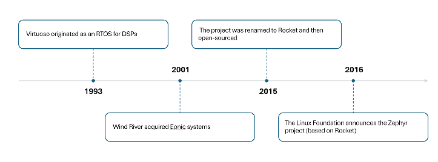

- After the Zephyr Project was announced and hosted by the Linux Foundation, it became supported by a big number of tech companies in the IoT, hardware, and software industry.

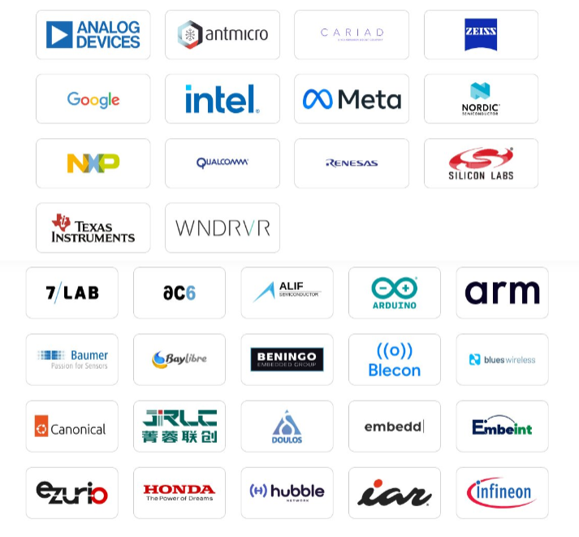

# 2.0 Building an Embedded Application

## 2.1 The Software Development Life-cycle (SDLC)

- The software development lifecycle refers to the steps taken to design, develop, test, deploy, and maintain software embedded in hardware systems.
- Typically, these steps vary according to the product itself. The following figure shows the general process.

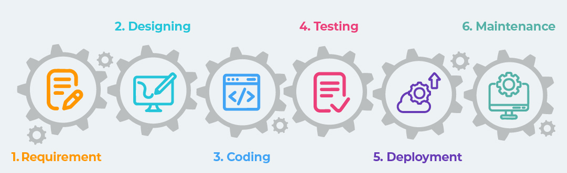

- It is good to keep this process in mind in order to see how Zephyr changes some of its aspects.

## 2.2 The Architecture

- The **architecture** of an embedded system is an abstraction of the embedded device. It showcases the structure of a complex system without having to go into layer details.

- On the broadest level, the architecture of an embedded system is composed of three layers: **the application software layer, the system software layer, and the hardware layer.**

  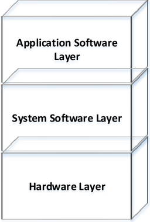

- The **hardware layer** defines all the physical hardware used in the system. It defines the microcontroller/SoC, the ISA, the sensors and actuators, the memory system, the input/output, the peripherals, etc.

- The **system software layer** groups the software responsible for interacting with the hardware layer and at the same time give an abstracted API to the application layer.

- Sometimes the system software layer can be broken down into sub-layers mainly **middleware, the operating system, HAL, and device drivers**.

- The term **middleware**, in general terms, refers to any system software that isn't the OS kernel, device driver, or application software. Examples of this are network stacks, file transfer/OTA updates, and USB stacks.

- The **application layer** contains the modules responsible for deploying the intended logic of the application. It is dependent on, managed, and run by the system software.

- The following figure depicts the more realistic architecture.

  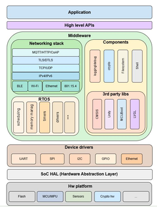

- Note that not all of these components have to exist in a given system, but it is common for modern embedded systems to require the use of many of them.

## 2.3 The Traditional Approach

- Now let's walk through each layer for each development cycle and figure out the traditional way an embedded system application is assembled.

  ### 2.3.1 The Hardware Layer

- When choosing hardware, the first thing to think about is whether it supports your application requirements.

- After that, there are other considerations that are important to address. For example, does the hardware vendor ship out its **SDK**? Does it provide **HAL APIs**?

  ### 2.3.2 The System Software Layer

- System software is a big layer with lots of components. A typical modern application will have to go through the process of deciding on each sub-layer individually.

  1. **The operating system:** the choice of the operating system is decided by the application scope, the cost, the support, the size, the performance, and the integration time.
  2. **The middleware:** the device might want to include libraries/modules to support functionalities required by the application (e.g. network stacks, wireless stack, graphics stacks, and cryptographic stacks). Some RTOS vendors ship paid middleware as bundles.

  ### 2.3.3 The Application Layer

- The software that sits in the application layer inherently defines what type of device an embedded system is, because the functionality of an application represents at the highest level the purpose of that embedded system and does most of the interaction with users of the device.

- The application software should be ready to go into the software cycle once all the underlying variables are decided.

# 3.0 The Zephyr Approach

- Instead of going the traditional approach of choosing every module in every layer and figuring out how it would be integrated, tested, and verified with with other layers, **Zephyr offers to give the complete architecture and leave it for you to choose and configure the modules for your use case**.

  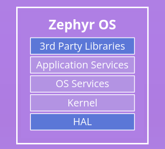

- Therefore, **Zephyr is not an ingredient. It provides a complete solution.**

- The development cycle changes now.

  1. **Hardware**: you go about choosing the hardware that fits with the application's requirements. Most likely, you will find it either as one Zephyr's supported SoCs or one of its supported boards. Even in the case it is not supported by default, board support can be added and even SoC support (see Resources(9)).
  2. **Middleware**: Zephyr has a robust RTOS kernel, a HAL layer, wireless/Bluetooth stacks, filesystem, and much more.
  3. **Application**: this layer doesn't change. Only it has to be configured and built according to the Zephyr build process.

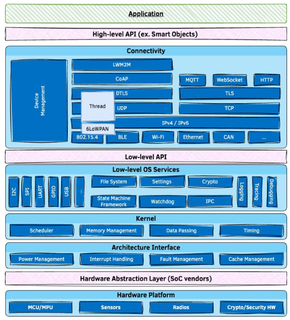

# 4.0 Why Does it Matter?

- You might ask the question "Why does this matter?". To answer that, several criteria should be considered.

## 4.1 Business Constraints

### 4.1.1 Time to Market

- The **Time to Market** is the time taken for the product developed to be launched into the market.
- Some of the hurdles that delay the time to market are the following:
  1. **Late hardware-software integration**: normally, teams working in the hardware need to collaborate with the software teams in the early process of development. Working with Zephyr shrinks the need for such time-consuming collaborations and makes hardware-software integration smooth.
  2. **Not leveraging reusable components**: adding new components introduces reliability and maintainability concerns. It also introduces additional time window for development and testing. Zephyr's suite of modules across the stack spares you from sourcing and integrating most of these components yourself, since the majority of what a team would otherwise build or buy already ships as a tested, maintained part of the platform.
- The traditional approach in 2.3 spends its early stages on hardware/software integration and component selection. **Zephyr collapses most of that into configuration**, picking a supported board, enabling the subsystems you need through Kconfig, and writing Devicetree overlays for anything board-specific. The time saved is in the early integration work rather than time spent in the later stages of development (coding, testing, and deployment).

### 4.1.2 Vendor Lock-in

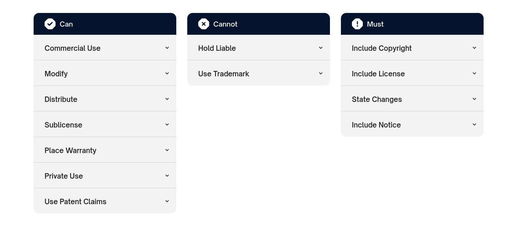

- Zephyr is a decentralized free and open-source project. It uses the **permissive Apache 2.0 license** which eliminates vendor lock in from its roots. Your application isn't simply dependent on a tool or a software from some vendor. Instead, Zephyr ensures that you can always port, integrate, or even build your own stack on top of it and then sell it under your license.

### 4.1.3 Cost

- There are two types of expenses in embedded systems: **recurring expenses** and **non-recurring expenses**. Recurring costs are related to each unit produced. Non-recurring costs, on the other hand, are the costs to produce the first unit.
- **Team size**: the more fragmented the stack is, the more specialized roles are needed (someone who owns the network stack, someone who owns the filesystem, someone who owns the the build tooling, and so on).
- **Hiring pipeline:** there is an availability risk of finding engineers who know a specific vendor's SDK, a specific RTOS, or a specific HAL layer. Zephyr resolves this by requiring experience in the Zephyr ecosystem itself and not necessarily in fragmented vendor's SDK or tooling.
- The cost here is not solely about the cost of a license or a product. It is more about how many people, with what skills, and for how long have to hold a stack that is not designed as one system.
- Using Zephyr, Non-recurring cost shifts from *building and integrating* the stack to *configuring and validating* it. Recurring cost drops for a related reason: because the pieces of the stack were designed to work together from the start, fewer specialized roles are needed just to keep the stack functional.
- And because Zephyr is licensed by Apache 2.0, there are no per-unit royalty to budget for.

### 4.1.4 Learning Curve

- Probably the one **big disadvantage** Zephyr has is its steep learning curve. However, it depends on the background of the engineer. If the engineer comes from a Linux background, it is usually easier since Zephyr borrows a lot of concepts from Linux.
- The best way to mitigate this cost is to reduce the scope early. Instead of chasing the latest release, lock down in a well-known release. Usually sticking with one project template can improve productivity.
- The following are best practices when it comes to learning Zephyr
  1. Begin with foundational Zephyr topics such as the basic application structure and build workflow.
  2. Integrate comprehensive, hands-on tutorials that walk through essential tasks such as configuring hardware with device tree overlays and customizing system behavior with Kconfig using practical examples.
  3. Encourage teamwork through code reviews, group debugging sessions and peer-to-peer mentoring.
  4. Utilize regular check-ins, surveys and reflective exercises to identify learning bottlenecks and adapt instructional methods accordingly.

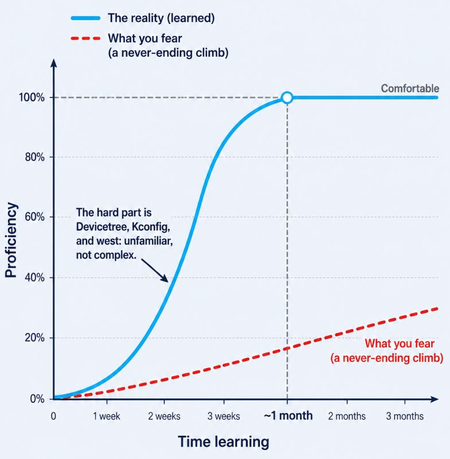

## 4.2 Engineering Constraints

### 4.2.1 Real-time Determinism

- Zephyr is built primarily as a real-time OS. This means the subsystems like the scheduler and locking are designed so that tasks are guaranteed to finish within a fixed time window.
- We'll dive more into what makes Zephyr a solid RTOS in section 7.

### 4.2.2 Memory Footprint

- Zephyr's memory usage is in the low KiB range for a stripped-down configuration.

- Zephyr provides a sample application called **minimal**, distributed with the project specifically to measure ROM footprint under different configurations. The officially documented combinations target the `reel_board` and toggle multithreading, preemption, and system timers independently, for example:

  `west build -b reel_board -d build/reel_board/no-mt samples/basic/minimal -- -DCONF_FILE="common.conf no-mt.conf arm.conf"`

  `west build -t rom_report -d build/reel_board/no-mt`

- Running the most stripped-down of these configurations reports a footprint in the low single-digit KiB range. Note that the features disabled here (multithreading, timers, software ISR talbes, task preemption) are all configurable rather than baked into the Zephyr kernel.

### 4.2.3 Power Consumption

- For battery-powered devices, power consumption is often as strict a constraint as memory footprint.
- Zephyr's power management subsystem handles consumption in two ways rather than leaving it entirely to application code.
  1. **System power management** runs from the idle thread. When there is no ready thread to run, Zephyr can automatically transition the SoC into a lower-power state (sleep, deep sleep, or off) based on the next scheduled wake-up event, without any explicit application logic.
  2. **Device (runtime) power management** lets individual drivers and subsystems suspend or resume specific peripherals independently of the CPU's own state. For example, powering down a sensor or a UART only while it's not in use, even if the CPU itself stays active. Devices track this through a small reference-counted API (`pm_device_runtime_get()` / `pm_device_runtime_put()`).
- Zephyr's model lets each layer make its own power decision independently, while still composing correctly with the others, rather than requiring one layer to have control over the system's power state.

### 4.2.4 Portability

- Because Zephyr shows abstraction, it makes moving from one hardware to another much easier than if you had to manage the full stack.
- Zephyr is compliant with standards like **CMSIS RTOS v1**, **CMSIS RTOS v2**, and **POSIX**. This makes OS-level porting manageable.
- Zephyr has **OSAL (OS abstraction layers)** which provide wrapper function APIs that *encapsulate* common system functions offered by any operating system.

### 4.2.5 Modularity

- Modularity measures how well software is decomposed into smaller pieces with standardized interfaces.
- Due to Zephyr's standard compliance and its OSAL (4.2.4), swapping in modules that comply with the same standards can be done without the system breaking.
- In the traditional stack design, you have to go through the process of choosing modules that comply with common standards. Zephyr already promises that.
- One part that keeps Zephyr's modularity is **Kconfig** (we'll dive into it in section 7.2.4). It offers compile-time selection of which subsystems/features are to be included.

## 4.3 Compliance Constraints

- Compliance constraints determine whether the application is *allowed* to ship at all. This may not only cause delay, it might cause complete disqualification.

### 4.3.1 Safety Certifications

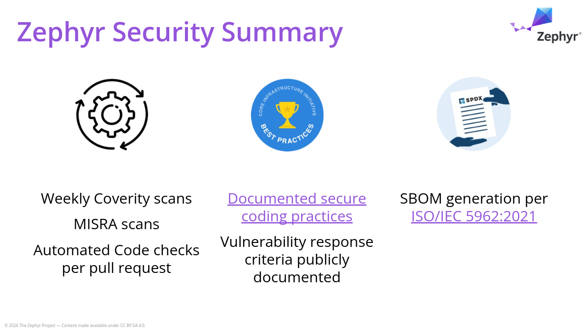

- Zephyr does not yet hold a formal safety certification, but it is working towards such goal.
- Zephyr has received **concept approval for IEC 61508** (industrial functional safety), meaning the certifying authority has confirmed that if the project delivers on its stated engineering approach, formal certification will follow.
- The target safety integrity level is **SIL 3** (of a possible SIL 4), which covers the large majority of real-world functional-safety use cases. Crucially, the certification scope is limited to the **core OS — the kernel and OS services** — across a select set of architectures. It explicitly excludes platform drivers, board support packages, filesystems, and sensor driver implementations for this initial submission, which matters for anyone planning a certified product.
- **ISO 26262** (automotive, targeting ASIL D) is next on the roadmap, planned to follow the IEC 61508 work.

### 4.3.2 Long Term Support (LTS)

- The development cycle of Zephyr goes through two phases: **development phase** and **stabilization phase**.
- The development phase focuses on the addition of new features while the stabilization phases focuses on bug fixes.
- After each stable release is made, a new “release branch” for that release is created.
- Long-term support releases are designed to be supported and maintained for an extended period and are the recommended release for products and the auditable branch used for certification.
- LTS is maintained for at least **5 years**.
- However, LTS takes longer to public (between every 2.5 to 3 years).
- LTS provides **longer stabilization periods**, **stable APIs**, and **continuous maintenance.**

# 5.0 Where Does Zephyr Fit?

## 5.1 Scale

- Zephyr is intended for systems that have real-time constraints, low to tight memory, low to medium processing power.
- Zephyr isn't made for high-end embedded applications. It is suited for systems that need features while still constrained by hardware, size, and performance.

## 5.2 Target Market

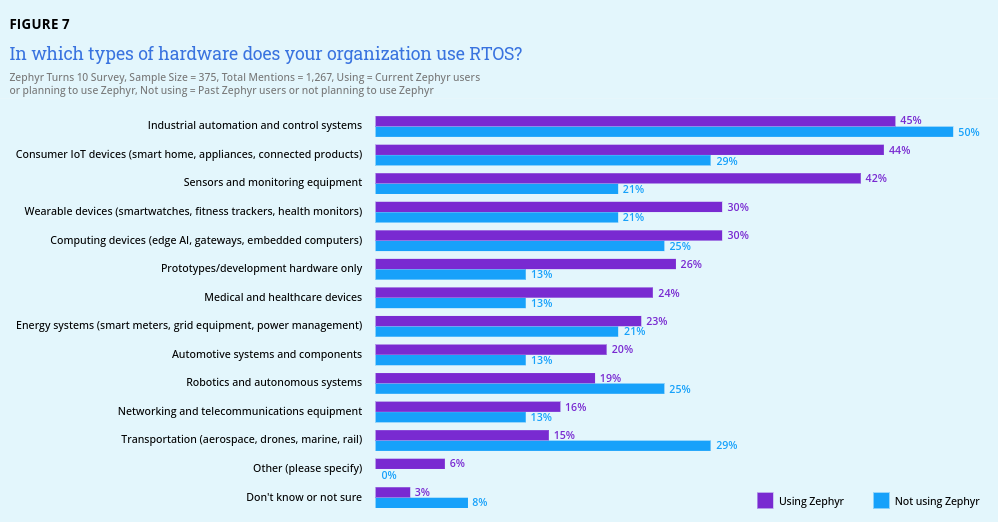

- According to a survey done on  26 Jul 2026, Zephyr is mostly used in **automation systems, consumer IoT devices, sensors and monitoring equipment, and wearable devices.**
- The following are some of the products running Zephyr today

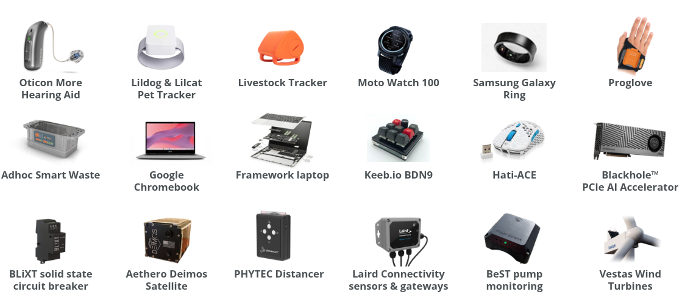

## 5.3 The OS Spectrum

- In the embedded applications market, there are a dozen of choices when it comes to embedded operating systems.
- An embedded application can go with a baremetal setup, a light RTOS like FreeRTOS, a more sophisticated RTOS like Zephyr, or a more capable Linux. Between each of the three OSes mentioned, there can lie dozens of other OSes varying in complexity and scope.
- The reason why such spectrum of setups exist is due to variance in application type and scope. Sometimes using an OS is wasteful. Sometimes it becomes central.
- If you think about the spectrum of operating systems and embedded system can you use, you can picture Zephyr sitting in the middle. It is not a huge power-hungry OS with all the features in the world. Also it is more than just a scheduler plus mutexes. It sits in the middle.

# 6.0 Security

## 6.1 The Security Model

- The three major security measures currently being implemented in Zephyr are:
  1. **Security Functionality** with a focus cryptographic algorithms and protocols, Zephyr is aiming to support more cryptographic hardware in future releases.
  2. **Quality Assurance** is driven by using a development process that requires all code to be reviewed before being committed to the main repository.
  3. **Execution Protection** includes thread separation and stack and memory protection enforced by the kernel itself.

## 6.2 Memory Protection Model

- On hardware with an MPU or MMU, Zephyr can run application threads in **user mode** — a lower CPU privilege level, isolated from the kernel and from other threads. A flawed or compromised user thread cannot read or corrupt another thread's memory, or the kernel's own data structures, without going through a defined system call.
- This isolation is built from a few concrete mechanisms:
  - **Stack overflow protection**: a write-protected guard region placed immediately before each thread's stack buffer catches overflows in hardware, and compiler-assisted stack canaries catch overflows within a single stack frame.
  - **Memory domains and partitions**: related threads can be grouped into a memory domain that grants them access to a defined set of memory partitions other threads don't have access to.
  - **Kernel object and driver permission tracking**: a user thread must be explicitly granted access to a given kernel object (a semaphore, a device driver instance, etc.) before it can use it.
- Zephyr enforces all this within its memory subsystem limits. Zephyr doesn't support processes the same way Linux does. It also doesn't contain paging mechanisms Linux uses. Thus, most security techniques that Linux implements within its memory subsystem don't make sense in Zephyr.

## 6.3 Secure Boot

- Zephyr's default bootloader is **MCUboot**, a project developed alongside Zephyr specifically to solve firmware integrity and update safety on microcontrollers. It runs before the application image and is responsible for two related guarantees:

  1. **Image authenticity**: MCUboot verifies a cryptographic signature (RSA, ECDSA, or Ed25519, depending on configuration) over the application image before allowing it to boot.
  2. **Safe and reversible updates**: flash is split into a primary slot, the running image, and a secondary slot (a staged update). On upgrade, MCUboot can swap the two images rather than overwrite in place, and the new image must explicitly confirm it has booted successfully. If something goes wrong, MCUboot reverts to the last image on the next boot.
  3. **Rollback protection**: an optional security counter embedded in each signed image prevents the device from being downgraded to an older image with a known vulnerability, even if that older image is still validly signed.

- Signing can be done using West.

`west sign -t imgtool -- --key my-key.pem`

## 6.4 The CVE Process

- Zephyr became a **CVE Numbering Authority (CNA)** in 2017, meaning the project can investigate, assign, and publish its own CVE identifiers rather than routing every report through a third party.
- Reports are handled by the **Zephyr Project Security Incident Response Team (PSIRT)**, made up of committee volunteers and platinum-member representatives. The published process gives concrete, checkable timelines: an initial acknowledgment within 7 working days, manufacturer notification and a fix made available within 30 days, and public disclosure of the vulnerability within a 90-day embargo overall, giving product teams a time window to patch.
- Once a fix lands, it isn't just applied to the latest release: Zephyr's policy backports every security fix to the current LTS branch and the two most recent releases.

# 7.0 The OS Design

- Before we can talk about some of the internal OS design features that make Zephyr unique in its class, we should briefly discuss the class of OS Zephyr lies under.

## 7.1 An RTOS vs a GPOS

- Zephyr is an **RTOS**, which means it's primary purpose is to provide a time-respecting system that assures minimum response times to tasks. This is basically what an RTOS is. Zephyr is used in the class of applications that prioritize real-time constraints.
- There are mainly three types of RTOS: **Hard RTOS, firm RTOS, and soft RTOS**.
- **Hard RTOSes** are the most strict when it comes to meeting deadlines. Missing a deadline is considered a system failure.
- **Firm RTOSes** are in the middle; they generally require meeting deadlines, but can occasionally tolerate delays. Such examples are media playback and networking applications.
- **Soft RTOSes** focus on timely execution but missing a deadline doesn't have any critical consequence. These include desktop operating systems and web servers.

## 7.2 Zephyr vs FreeRTOS vs Linux

- After we got a decent introduction to Zephyr's overall architecture and design, we dive into a technical comparison between three of the most used operating systems in the embedded systems world.

### 7.2.1 Overall Design

|                | FreeRTOS                           | Zephyr                                                       | Linux                                                        |
| -------------- | ---------------------------------- | ------------------------------------------------------------ | ------------------------------------------------------------ |
| Design         | Minimal: a scheduler + mutexes     | Modular, configurable, and low footprint                     | Customizable, big, and configurable                          |
| Scheduling     | Basic task switching               | Fixed-priority preemptive/cooperative, with optional EDF (Earliest Deadline First) | Uses the CFS by default. Can be configured to soft-real time (PREEMPT_RT) |
| Device Drivers | None (have to be added externally) | Supports device drivers for multiple embedded boards         | Supports drivers for desktop, server, and supercomputer hardware |

### 7.2.2 The Scheduler

- Zephyr's scheduler is **priority-based**. Every thread has a static priority, and every thread of a strictly higher priority preempts one of lower priority.
- Threads fall into two classes:
  - **Cooperative threads** (negative priority values) run to completion until they explicitly yield, sleep, or block. A cooperative thread cannot be interrupted by another thread, only by an ISR.
  - **Preemptive threads** (non-negative priority values) can be preempted at any time by a higher-priority thread, and optionally time-sliced against threads of equal priority to prevent starvation.
- Interrupts always take precedence over thread execution unless explicitly masked.
- The underlying ready-queue data structure is itself configurable, letting a team trade code size and RAM against thread-count scalability: a simple linked list (`CONFIG_SCHED_DUMB`) for applications with few threads, a red-black tree (`CONFIG_SCHED_SCALABLE`) for many concurrent threads, or the classic array-of-lists-per-priority (`CONFIG_SCHED_MULTIQ`) for O(1) scheduling at a higher RAM cost.
- **Earliest-deadline-first (EDF) scheduling** (`CONFIG_SCHED_DEADLINE`) is an optional addition on top of this, used only to break ties between threads that already share the same static priority.

### 7.2.3 Device Driver Model

- Every peripheral in Zephyr is represented at runtime by a common `struct device`, holding a name, a pointer to build-time configuration data (register addresses, IRQ lines), a pointer to runtime state (buffers, semaphores, reference counts), and a pointer to an API structure (mapping to a specific vendor implementation).
- Application and subsystem code is written against the generic API only, never against a vendor's registers directly. 
- Devices are declared through Devicetree using macros like `DEVICE_DT_DEFINE()` — the driver author writes the implementation once, and each board's `.dts` file instantiates the driver for whatever pins, bus, and address that board actually uses.
- Drivers are initialized automatically before `main()` runs, in an order controlled by an initialization level and a priority within that level. For example, an interrupt controller is guaranteed to be ready before a UART driver that depends on it. Application code can always check `device_is_ready()` before use.

### 7.2.4 Other Subsystems

|                  | FreeRTOS                                                 | Zephyr                                       | Linux                                                       |
| ---------------- | -------------------------------------------------------- | -------------------------------------------- | ----------------------------------------------------------- |
| Memory           | Support for MPU                                          | Supports VM for MMU devices. Support for MPU | Requires MMU. Sophisticated memory system                   |
| Filesystem       | None                                                     | Supports VFS for mounting filesystems        | Supports various (ext, zfs, btrfs, etc.)                    |
| Networking       | None, but provides an external library                   | Has a native network stack                   | Sophisticated network stack with support to old/new devices |
| Power Management | None                                                     | Built-in power management subsystem          | Sophisticated support. Allows suspending and hibernation.   |
| IPC              | Queues                                                   | Provides an API for data exchange            | Signals, pipes, sockets, shared memories, and more          |
| Synchronization  | Supports threads (called tasks), mutexes, and semaphores | Supports threads and semaphores              | Supports advanced synchronization methods like RCU          |

## 7.2.5 Configuration and Build System

- One of the most unique things about Zephyr is its configuration and build system. It is also one big key in Zephyr's modularity.
- Zephyr uses the following:
  - CMake & Zephyr's CMake package
  - Devicetrees
  - Kconfig
  - Snippets
  - Sysbuild
  - Application Version Management
- **CMake** is used to build the application with the Zephyr kernel. It generates build scripts that are native to the host platform.
- **Devicetrees** are used to include devices for the build. Zephyr borrows this structure from Linux. Basically, devices are inserted in a tree structure as nodes. Configuration can be done in the .dts files and then the **device tree compiler** can generate the device tree **binary**.
- **Kconfig** is another concept that is borrowed from Linux. The same way Linux uses Kconfig to control which parts of the kernel and which device drivers are going to be added the build, Zephyr controls which peripherals/ drivers get support in the application.
- **Snippets** are a way to save build system settings in one place, and then use those settings when you build any Zephyr application. This lets you save common configurations that apply to different applications.
- **Sysbuild** enables the combination of multiple build systems together. It is written in CMake and uses Kconfig. For example, it can be used to build a Zephyr application with a bootloader, flash them onto a device, and debug the results.
- **Application version management** enables applications to define a version file and have an application, or module, code include the auto-generated file and be able to access it. *

## 7.3 Size and Performance

### 7.3.1 RAM/ROM Footprint

- As shown in 4.2.2, Zephyr's most stripped-down configuration reports a footprint in the low single-digit KiB range using the `minimal` sample — a figure worth re-measuring against the current release rather than treated as fixed. What matters more than the exact number is that the same kernel scales from that minimal build up to a full-featured one, purely through configuration, rather than requiring a different codebase at each end of the range.

### 7.3.2 Interrupt latency, IPC, and synchronization

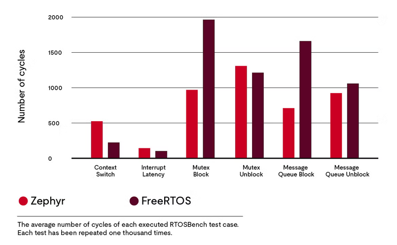

- Zephyr's task synchronization (mutexes) block for a lower number of cycles. Interrupt latency is about the same as FreeRTOS. Context switching in FreeRTOS is faster.
- One reason for the task synchronization difference is that FreeRTOS reuses the code for message queues to implement mutexes while Zephyr uses a separate mutex implementation.
- Zephyr's task communication (queue block and unblock) is also superior.

### 7.3.3 The C Library

- Both FreeRTOS and Linux don't integrate a C library by default. Zephyr supports integration for multiple C libraries including the following:
  1. **Common C library** is designed to be used in alongside multiple C libraries. They contain APIs that are not found in the multiple C libraries or APIs that are found but should be implemented better to suit the Zephyr environment. For example. the `time()` function is implemented in the common C library to use the function `sys_clock_gettime()`.
  2. **Minimal libc** is the most basic C library. It provides the minimum subset of the standard C library required to meet Zephyr's needs (primarily in the areas of string manipulation and display.)
  3. **Newlib** is an open source project that offers a complete C library implementation written for embedded systems. The Zephyr SDK includes Newlib in two version: **full and nano.**
  4. **Picolibc** is a complete modern C library implementation for embedded systems that targets **C17**.
- **glibc** and **musl** are two common C libraries that go on top of Linux. However, Newlib and Picolibc can also be integrated.

# 8.0 Where is Zephyr Going?

- The Zephyr Project was announced by the Linux Foundation in February 2016, and in 2026 it marked its 10-year anniversary. A decade in, it supports more than 1,000 boards across multiple architectures and has grown from roughly 100 contributors at launch to over 3,000 contributors globally — a trajectory covered in the Linux Foundation's own 10-year retrospective research (see Resources).

## 8.1 The Community

|           | Contributors | Commits  |
| --------- | ------------ | -------- |
| Zephyr    | 3490         | ~174,000 |
| RT-thread | 823          | ~18,000  |
| NuttX     | 730          | ~62,500  |
| RIOT-OS   | 388          | ~50,000  |
| FreeRTOS  | 246          | ~3,700   |

- Compared to August 2025, Zephyr has had an additional **700** contributor. It also had an additional **54,000** commits.

## 8.2 The Future of Zephyr

* Zephyr is continuing to show rising board support stats. In the past year, 300+ boards have been supported. As for the future, this increase is going higher

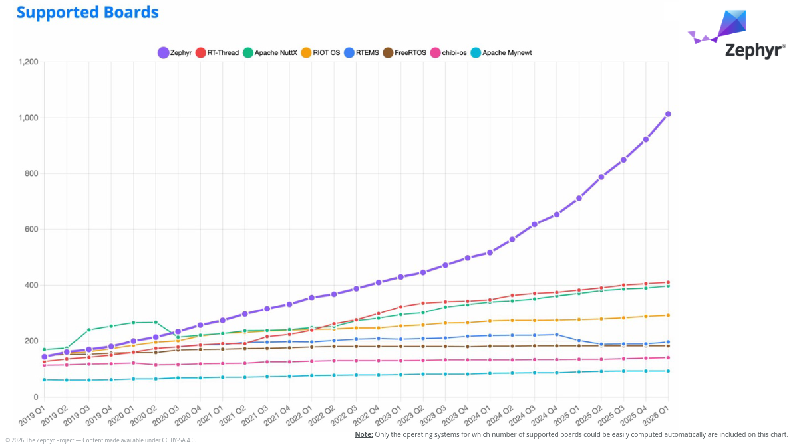

- On the other hand, maintenance and LTS, safety certifications, and documentation are the current challenges that face Zephyr.

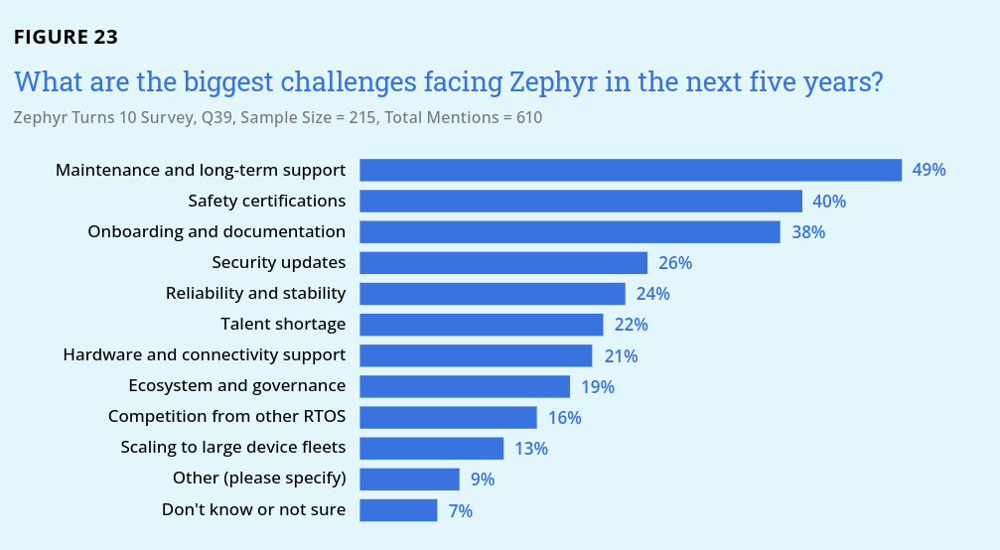

# 9.0 Resources

1. [Zephyr GitHub repository](https://github.com/zephyrproject-rtos/zephyr)
2. [Zephyr Project Overview](https://www.zephyrproject.org/wp-content/uploads/2026/04/Zephyr-Overview-20260424.pdf)
3. [Zephyr Turns 10](https://www.linuxfoundation.org/hubfs/Research Reports/ZephyrTurns10_Report_Revised_051826.pdf?hsLang=en)
4. [Zephyr Project Documentation](https://docs.zephyrproject.org/latest)
5. [Comparing FreeRTOS vs. Zephyr](https://www.ul.com/sis/blog/measuring-real-time-operating-system-performance-part-ii-comparing-freertos-vs-zephyr)
6. [Zephyr's Build System](https://docs.zephyrproject.org/latest/build/index.html)
7. [Zephyr C Language Support](https://docs.zephyrproject.org/latest/develop/languages/c/index.html)
8. [Leveraging Zephyr RTOS for modern embedded systems](https://ceur-ws.org/Vol-4184/paper4.pdf)
9. [Architecture Porting Guide — Zephyr Project Documentation](https://docs.zephyrproject.org/latest/hardware/porting/arch.html#architecture-porting-guide)
10. [Zephyr Project Security](https://zephyrproject.org/security/)
11. [Security Vulnerability Reporting — Zephyr Project Documentation](https://docs.zephyrproject.org/latest/security/reporting.html)
12. [User Mode Overview — Zephyr Project Documentation](https://docs.zephyrproject.org/latest/kernel/usermode/overview.html)
13. [Memory Protection Design — Zephyr Project Documentation](https://docs.zephyrproject.org/latest/kernel/usermode/memory_domain.html)
14. [MCUboot Design Documentation](https://docs.mcuboot.com/design.html)
15. [Power Management — Zephyr Project Documentation](https://docs.zephyrproject.org/latest/services/pm/index.html)