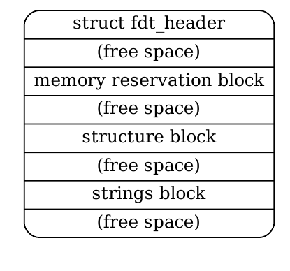

# Devicetree Introduction

# Agenda

1. The need for hardware description
2. The pre-Devicetree era
3. What is the Devicetree?
5. Basics of Devicetree semantics
6. Basics of Devicetree Bindings
7. Devicetrees in Zephyr
8. Compilation process in Zephyr
9. Resources

# 1.0 The Need for Hardware Description

* For systems/applications that rely on hardware, there must be a way to describe this hardware. For example, in a baremetal embedded application, there must be some way to point out that there is a supported `CPU`, `UART`, and `SRAM`. These components have **properties**; you might want to know the frequency of the CPU, the speed of the UART, and the layout of the memory.
* The hardware differs per board, per device, and per architecture. However, sometimes the same hardware is found in multiple boards or devices. For example, the same **ARM-M4** processor might sit in a board made by **ST** and in another board by **Texas Instruments**. Hardware description needed to be as **generic** as possible for platforms that supported many devices. Otherwise, it would be a pain to describe all of them independently.

# 2.0 The Pre-Devicetree Era

* Normally, hardware description was done in code. It was part of compilation and marked its way inside the binary/image.
* **First, there was preprocessing.** The idea is to describe hardware as preprocessor conditions and macros. For example take a look at this code:

```C
/* TWL4030 PMIC / battery charger (bci) */
#define CONFIG_TWL4030_POWER
#define CONFIG_TWL4030_BCI_IRQ0        9
#define CONFIG_TWL4030_BCI_IRQ1        2
```

* The **TWL4030** is a power management module. Now the **Battery communication interface (BCI)** has two IRQ lines in this model. If the power module is enabled (defined in the code), the system can undergo initialization like this:

```c
#ifdef CONFIG_TWL4030_POWER
    twl4030_bci_init(CONFIG_TWL4030_BCI_IRQ0, CONFIG_TWL4030_BCI_IRQ1);
#endif
```

* In this approach, we initialize the module based on whether it is powered or not (which we deduce from the macro).
* There are several problems with this approach.
  1. This hardware is now tied to using channel 9 for IRQ0 and channel 2 for IRQ1. If there is another device that uses the TWL4030 but has a different IRQ line, it cannot be incorporated with another redefinition.
  2. The TWL4030 device driver now has to be aware of these macros. Thus, they are not generic drivers but rather tied to a specific configuration.
  3. There is no structure or validation to this approach. Misspelling a macro name can fail without any runtime indication. 
* Another approach was the **boards** approach. This approach was used in early versions of the Linux kernel. The idea is that instead of preprocessing, hardware description **was done in compile time.** It was basically a description of the platform written in **C**.
*  Take a look at this example.

```C
    MACHINE_START(GTA04, "GTA04")
        /* Maintainer: Nikolaus Schaller - http://www.gta04.org */
        .atag_offset    =   0x100,
        .reserve    	=   omap_reserve,
        .map_io    	=   omap3_map_io,
        .init_irq   	=   omap3_init_irq,
        .handle_irq 	=   omap3_intc_handle_irq,
        .init_early 	=   omap3_init_early,
        .init_machine   =   gta04_init,
        .init_late  	=   omap3630_init_late,
        .timer      	=   &omap3_secure_timer,
        .restart    	=   omap_prcm_restart,
    MACHINE_END
```

* This is a board file for the **GTA04** board based on the **omap3** SoC. This snippet is from a __board file__ under the `arch/` directory in the Linux kernel. This code no longer sits in the Linux kernel since it started using Devicetrees.

* Anyway, you can see here that there are multiple assignments to **omap3_\*** properties. The only assignment that is specific to this driver is the following line:

  ```C
  .init_machine = gta04_init
  ```

* Note that this assignment in a series of __ad-hoc__ function calls that end up creating the hardware descriptions for the device.

* Two of these functions calls are `platform_add_devices()` and `omap_register_i2c_bus()`.  These provide lists of device identifiers together with "`platform_data`" data structures which describe many of the various components on the **GTA04** board and how they are connected together.

* So the **board file** does three things:

  1. Identifies the SoC.
  2. Identifies the components.
  3. Uses "glue" code to make things work.

* Note that this has a few drawbacks.

  1. Note that the board file contains initializations related to the SoC, which means any other board would have the same code. This adds **redundancy**. 
  1. As new boards are added, new function logic needs to be added. Also recompilation is needed.

# 3.0 What is the Devicetree

* Instead of defining hardware description as logic implemented in code, Devicetrees describe hardware as **a tree data structure**. This data structure has its own **compiler** (the Devicetree compiler, dtc) and thus can be compiled outside of application code.
* The following is a simple Devicetree diagram of a SoC under which lies an **I2C bus controller** with a bunch of peripherals underneath.


* The following is the Devicetree syntax for the above diagram.

```c
/dts-v1/;

/ { 
    SoC {
      I2C_bus_controller {
        
        I2C_peripheral_1 {
            /* peripheral properties */
        };
        I2C_peripheral_2 {
            /* peripheral properties */
        };
        I2C_periphaeral_3 {
            /* peripheral properties */
        };
          
      };
    };
};
```

* Now we can compile this simple source as follows

`dtc -I dts -O dtb -o example.dtb example.dts` 

   * **`-I`** specifies the input format (in this case it is the Devicetree source.)
   * **`-O`** specifies the output format (in this case it is the Devicetree **blob**.)
   * **`-o`** specifies the output file name.

* Now let's take a look at the output file.

```
-> hexdump -C example.dtb
00000000  d0 0d fe ed 00 00 00 c4  00 00 00 38 00 00 00 c4  |...........8....|
00000010  00 00 00 28 00 00 00 11  00 00 00 10 00 00 00 00  |...(............|
00000020  00 00 00 00 00 00 00 8c  00 00 00 00 00 00 00 00  |................|
00000030  00 00 00 00 00 00 00 00  00 00 00 01 00 00 00 00  |................|
00000040  00 00 00 01 53 6f 43 00  00 00 00 01 49 32 43 5f  |....SoC.....I2C_|
00000050  62 75 73 5f 63 6f 6e 74  72 6f 6c 6c 65 72 00 00  |bus_controller..|
00000060  00 00 00 01 49 32 43 5f  70 65 72 69 70 68 65 72  |....I2C_peripher|
00000070  61 6c 5f 31 00 00 00 00  00 00 00 02 00 00 00 01  |al_1............|
00000080  49 32 43 5f 70 65 72 69  70 68 65 72 61 6c 5f 32  |I2C_peripheral_2|
00000090  00 00 00 00 00 00 00 02  00 00 00 01 49 32 43 5f  |............I2C_|
000000a0  70 65 72 69 70 68 61 65  72 61 6c 5f 33 00 00 00  |periphaeral_3...|
000000b0  00 00 00 02 00 00 00 02  00 00 00 02 00 00 00 02  |................|
000000c0  00 00 00 09                                       |....|
000000c4
```

* The dtb format is described in the following figure.

  

* Note the following.

  1. The magic number at the start (`0xd00dfeed`) (part of the `struct fdt_header`.)
  2. The size of blob (`0xc4` or `196` bytes) (also part of the `struct fdt_header`.)
  3. The names of the nodes in the middle of the blob.

* You can see that the Devicetree blob (dtb) is just independent data that **has its own format** and can be compiled/decompiled on its own.

# 4.0 Basics of Devicetree Semantics

* There are three aspects to the Devicetree semantics: The **structure**, the **properties**, and the **conventions**.
* As for the **structure**, the Devicetree is a **tree** that has a root node usually written as **/**. From this root node, other nodes stem.
* Any node can be addressed by its full path. For example, to reference the `I2C_peripheral_2` node, you would do `/SoC/I2C_controller/I2C_peripheral_2` much like what you would do to access a directory in any UNIX-like OS.
* As for the **properties**, they do the actual hardware description. So if that I2C_controller has an address in memory, we would describe that using properties. It it has a maximum number of slaves, we would also describe that using properties.
* Properties are determined by other files, which are called the **bindings**. They decide what each property mean and what device would be able to use it.
* For the **conventions**, there are some naming and accessing conventions that are used whether Devicetrees are dealt with. Also, there are other unique **Zephyr** conventions.
* **The next couple of tutorials are going to go over these in details**.

# 5.0 Basics of Devicetree Bindings

* Devicetrees cannot fully describe hardware without bindings. 
* Devicetree bindings declare requirements of the contents of nodes and provide semantic information for contents of valid nodes.
* Devicetree binding format and validation techniques can differ from platform to another. For example, **Linux** validates its YAML-based bindings using the `dt-schema` toolchain, while **Zephyr** uses its own binding-parsing tooling.
* Let's expand on the example mentioned above.

```c
/dts-v1/;

/ { 
    SoC {
      I2C_bus_controller {
        compatible = "intel,pch";
        num-slaves = <3>;
        I2C_peripheral_1 {
            /* peripheral properties */
        };
        I2C_peripheral_2 {
            /* peripheral properties */
        };
        I2C_periphaeral_3 {
            /* peripheral properties */
        };
          
      };
    };
};
```

* Note that here the `I2C_bus_controller` node is **compatible** with the Intel's PCH controllers (the naming `intel,pch` is convention). Now take a look at the bindings file (written in `yaml`)

```yaml
compatible: "intel,pch"

properties:
  num-slaves:
    type: int
    required: true
    
```

* Note here that our node matches this binding because it is compatible with it (via the compatible property). The bindings defies the `num-slaves` property, which is an `int` and is required for any device that is compatible with the `intel,pch`.
* The build system usually relies on the bindings files to verify the Devicetree and make sure nothing is missing.

# 6.0 Devicetrees in Zephyr

* Zephyr relies on Devicetrees to describe all the boards it supports. However, Zephyr's approach is different from other operating system.
* Zephyr parses and compiles the Devicetree at compilation time. It **parses the Devicetree statically**. The Devicetree gets parsed into macro expansions that can be read and abstracted by the APIs in `devicetree_generated.h`. Zephyr uses the `dtlib` python library to extract information from the Devicetree.
* Having the Devicetree parsed at compile time has a couple of advantages for Zephyr's ecosystems
  1. Produce a binary image with the specific board Devicetree per target board (which is the Zephyr way of generating images.) (This is opposed to something like Linux which normally doesn't produce an image for every board or computer.)
  2. Doesn't include the dynamic parsing overhead.
* The Devicetree approach results in an automated generation of DT macros that can be used inside applications and configurations.

# 7.0 Compilation Process in Zephyr

* The following figure shows the highest level view of how Devicetrees make their way into code and application files.


* Note here that the Devicetree gets compiled and fit into a generated header file. There is no actual manual macro descriptions happening. On top of that, the `devicetree.h` offers an abstraction layer to prevent the user from manually going into the generated header file and looking for data himself.
* **In the next couple of tutorials, we'll dive more into the compilation process plus some real board examples.** 

# 8.0 Resources

1. [Zephyr Docs - Introduction to DT](https://docs.zephyrproject.org/latest/build/dts/intro.html)
2. [Device trees I: Are we having fun yet?](https://lwn.net/Articles/572692/)
3. [Engaging Device Trees](http://events17.linuxfoundation.org/sites/events/files/slides/Engaging_Device_Trees_0.pdf)
4. [Linux and the Devicetree](https://docs.kernel.org/devicetree/usage-model.html)